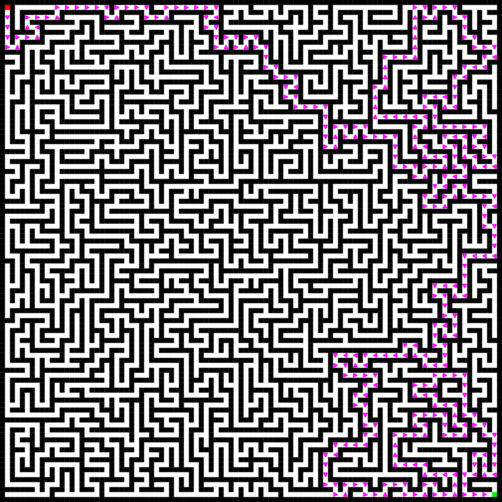

# maze-generator
Produces perfect square mazes and optionally solves them too.

Built-in help: 

Usage: java Maze h w [-h] [-o ODC] [-d] [-t] [-p] \
h w Height and Width of the maze, in squares \
-h Shows help \
-o Opens doors to create loops in the otherwise perfect maze, each with probability of ODC \
-d Draws the solution with triangles \
-p If present, prints the maze to stdout instead of drawing anything 

